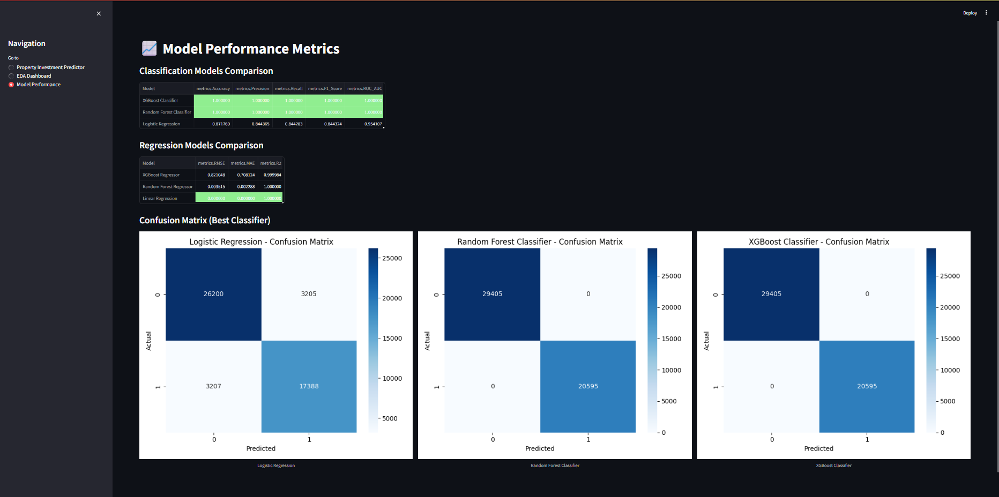
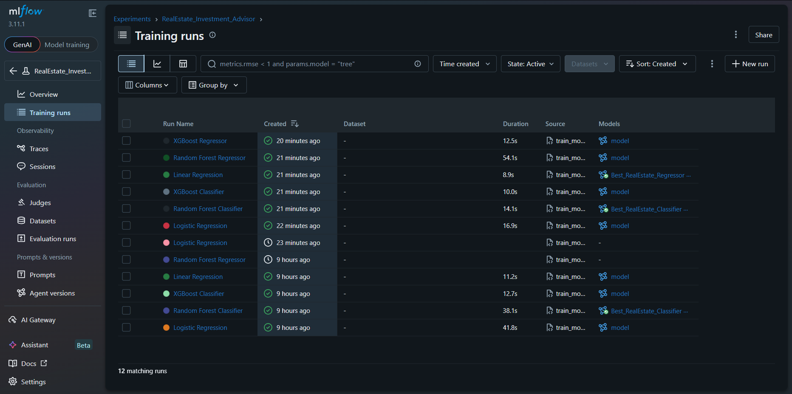

# 🏡 Real Estate Investment Advisor

A comprehensive end-to-end Machine Learning project designed to analyze the Indian housing market, predict property investment viability, and estimate future valuation trends. This project features a robust data pipeline, MLflow experiment tracking, and a multi-page Streamlit dashboard.

---

## 🚀 Project Overview

The **Real Estate Investment Advisor** automates the lifecycle of property analysis:
1.  **Data Preprocessing**: Cleaning, imputation, and advanced feature engineering.
2.  **Exploratory Data Analysis (EDA)**: Generation of 20+ visual insights into market trends.
3.  **Model Training**: Comparison of multiple Classification and Regression models (Logistic Regression, Random Forest, XGBoost).
4.  **Experiment Tracking**: Full audit trail of model performance via MLflow.
5.  **Interactive Dashboard**: A user-friendly Streamlit app for real-time predictions and data visualization.

---

## 🛠️ Technology Stack

-   **Logic**: Python 3.x
-   **Data Processing**: Pandas, NumPy, Scikit-learn
-   **Modeling**: XGBoost, Scikit-learn (Random Forest, Linear Models)
-   **Tracking**: MLflow
-   **Visualization**: Matplotlib, Seaborn
-   **Web App**: Streamlit

---

## 📊 Project Pipeline

### 1. Data Preprocessing (`preprocessing.py`)
-   Handles missing values (Median for Numerical, Mode for Categorical).
-   Encodes 12+ categorical features.
-   Engineers new features: `Price_per_SqFt`, `Age_of_Property`, `School_Density_Score`, and `Future_Price_5Y`.
-   Calculates the `Good_Investment` label based on market medians and property size.

### 2. EDA (`eda.py`)
-   Generates 20 high-quality charts saved as `.png` files in the `eda_charts/` directory.
-   Visualizes distribution, correlation, and geographical price trends.

### 3. Model Training (`train_models.py`)
-   Trains and evaluates 6 different models.
-   Logs parameters, metrics (Accuracy, F1, RMSE, R2), and confusion matrices to MLflow.
-   Saves the best-performing models to the `models/` directory for production use.

### 4. Streamlit App (`app.py`)
-   **Investment Predictor**: Interactive form for property evaluation.
-   **EDA Dashboard**: Display of pre-generated charts with dynamic filtering capabilities.
-   **Model Performance**: Live comparison of tracked experiments.

---

## 🖼️ Application Gallery

### Investment Predictor


### Exploratory Data Analysis


### Model Performance & Tracking



---

## ⚙️ Installation & Usage

### 1. Clone & Setup
```bash
# Clone the repository
git clone <repository-url>
cd real-estate-investment-advisor

# Install dependencies
pip install -r requirements.txt
```

### 2. Run the Pipeline
```bash
# Preprocess data
python preprocessing.py

# Generate EDA charts
python eda.py

# Train models
python train_models.py
```

### 3. Launch the Dashboard
```bash
# Start MLflow UI (Background)
mlflow ui

# Start Streamlit
streamlit run app.py
```

---

## 📁 Project Structure
-   `preprocessing.py`: Data cleaning and feature engineering.
-   `eda.py`: Visualization generation script.
-   `train_models.py`: Model training and MLflow tracking.
-   `app.py`: Streamlit frontend.
-   `models/`: Cached models and transformers.
-   `eda_charts/`: Exported visualizations.
-   `screenshots/`: UI previews.